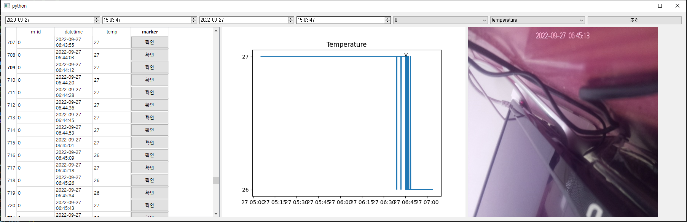

# IoT_RaspberryPi4_with_Kafka

선택한 날짜의 특정 기기의 데이터베이스를 선택하여 조회한 후 기기의 센서값을 확인할 수 있게 도와줍니다. 
데이터 테이블의 확인 버튼을 누르면 그래프에 마커가 찍히고 해당 데이터의 날짜 기준으로 최근 캡처를 띄워줍니다.

## 개발 의의
라즈베리 파이의 센서 데이터들을 사용자의 컴퓨터에서 확인하고 분석할 수 있게 Kafka를 이용하여 통신합니다. 
기본적으로 온도와 카메라의 캡처 데이터만 받을 수 있게 해놨으며, 센서가 늘어나면 DB와 Kafka의 topic을 추가하여 확장시킬 수 있습니다. 

## 소요 라이브러리
* Front (GUI)
   - PyQt5
   - Matplotlib
   - OpenCv
* Back
   - Pymongo
   - kafka
   - confluent_kafka
   - pandas
* Aux
   - json
   - datetime
   - sys
   - base64
   - dateutil.relativedelta

## 참고 사항
https://ealloons.github.io/third/ 에 코드 해석이 있습니다.
